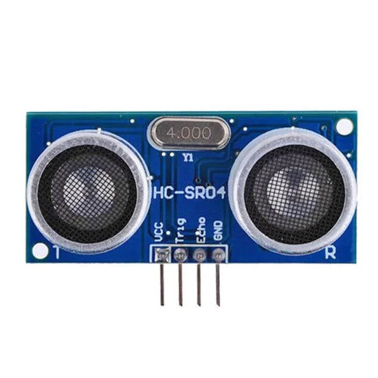

# Módulo HC-SR04

Módulo utilizado para medir a distância entre o módulo e objetivos utilizando ondas ultra-sônicas, alta precisão para objetos que se encontram entre 3 cm a 2,5 metros/ 3 metros de distância. Pode ser encontrado custando por volta de R$10,00 ou menos. Funciona emitindo essas ondas-ultrassônicas que ao colidirem com o objetivo e ter o som interceptado pelo módulo é possível calcular a distância no qual foi percorrida por cada onda. A distância pode ser calculada pela velocidade do som multiplicada pelo tempo, para ter apenas a distância de ida ou volta devemos dividir por 2. Equação: distância = velocidade do som * tempo / 2. A velocidade do som é de 343 m/s, para podermos medir a distância dos objetos em centímetros, podemos converter para 0,034 cm/µs (centímetro/microssegundo), tendo assim distância = 0,034 cm/µs * tempo / 2. O tempo é medido pelo sensor ao emitir pulso, então para conseguirmos utilizar o módulo, basta aplicarmos a função e substituirmos o tempo pelo pulso do módulo.

# Conexões

Segue as seguintes conexões que devem ser realizadas, lado esquerdo representa o módulo e no lado direito usei as conexões do ESP32 de exemplo.

VCC - 5V

Trig - D5

Echo - D18

GND - GND
